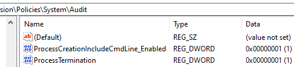

# auto-git-updates
Make git repo automatically up to date with powershell,

Choose an app (for example *notepad*) ->

When the app you chose is **launched** -> perform `git pull`

When the app you chose is **closed** -> perform `git add & commit & push`

It's all performed with schedule task for pull and for push, triggered by event log of process creation and process termination.

# Set up
## Allow logs of process creation and termination
* open event viewer with `Win + R` then `eventvwr.msc`
* on the left side, go to **Windows Logs -> Security**
* on the right side, click `Filter Current Log`
* Check logs a enabled: in the filter window, under Event IDs, enter 4688 (event ID for a new process creation) and then 4689 (event ID for a process termination).
### if you see logs for both 4688 and 4689 - jump to [Schedule the tasks](#schedule-the-tasks)
### if you don't see any logs for either 4688 or 4689:
* open registry editor with `Win + R` then `regedit`
* search for `HKEY_LOCAL_MACHINE\SOFTWARE\Microsoft\Windows\CurrentVersion\Policies\System\Audit`
* If the **Audit** key doesn't exist, right-click on the **System** key, select **New > Key**, and name it **Audit**.
#### if `ProcessCreationIncludeCmdLine_Enabled`doesn't exist:
* Within the **Audit** key, right-click in the right pane, select **New > DWORD (32-bit) Value**.
* Name the value **ProcessCreationIncludeCmdLine_Enabled**.
* Set its value to `1` (this enables auditing of process creation).
#### if `ProcessTermination`doesn't exist:
* Within the **Audit** key, right-click in the right pane, select **New > DWORD (32-bit) Value**.
* Name the value **ProcessTermination**.
* Set its value to `1` (this enables auditing of process termination).

This is how it should look like:

### enable process auditing
* open CMD as admin
* run `auditpol /set /subcategory:"Process Creation" /success:enable /failure:enable`
* verify the setting by running: `auditpol /get /subcategory:"Process Creation"`
* run `auditpol /set /subcategory:"Process Termination" /success:enable /failure:enable`
* verify the setting by running: `auditpol /get /subcategory:"Process Termination"`
### verify logs in event viewer
* open and close random app, return to event viewer and refresh (`F5`) to see the logs.

# Schedule the tasks
simply run `schedule_git_updater.ps1` via _powershell_, and follow the input prompts
(full path of the app exe file, full path for your git repo, app name for readability in Task Scheduler).

You should get 2 prompted messages saying that 2 tasks were created successfully.

**Enjoy :)**
